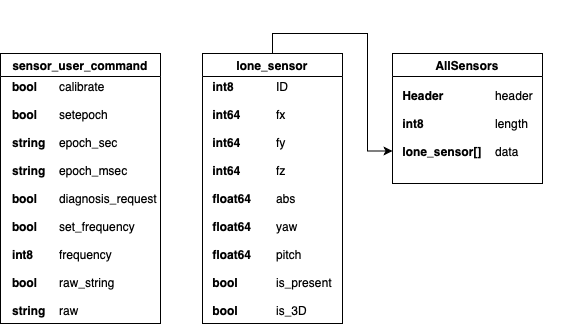
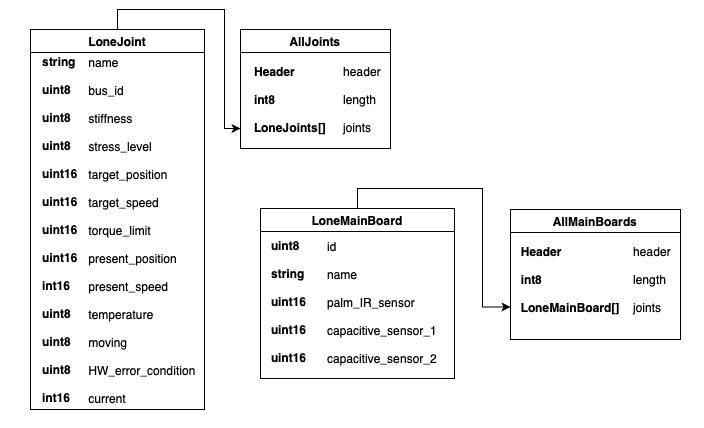
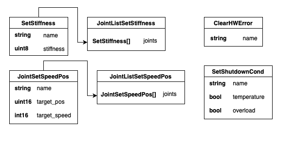

#################### ROS_ROBOTHANDS ####################
########################################################

#################### PROJECT DESCRIPTION ###############
########################################################

This project includes 2 custom ROS packages to ease the use of Seed Robotics products with ROS.

The first package is named "seed_robotics". It allows the user to communicate with a Seed Robotics robotic hand. Communication includes continuous reading in motors memory and making these informations available using ROS messages. This package also allows the user to write to the motors using ROS messages, the user will be able to change the position and the speed of several motors at the same time. It will also be possible to change the stiffness of a motor, to clear its hardware error and to change its shutdown conditions. The instructions for the use of this package will follow. These communications can be done by the user either using command lines, or using Python script (using the rospy library) or CPP project (using rocpp library). There are examples on how to use these different features using python scripts in the src/seed_robotics/user_samples folder. These samples will be explained later. Note that this package allows a  maximum working frequency of 50Hz.

The second package is named "sensor_pkg". It eases the communication with Seed Robotics FTS3 and FTS1 pressure sensors using ROS. This package was already available on Github, but here is the latest version, and also the one that allows the user to use it in combination with the ROS package for the Hand control. The sensor_pkg can also be used alone if needed. Its features are the realtime reading of informations sent by the sensor through ROS messages. The sensor_pkg also allows the user to send command to the sensors, either via command lines or using Python script (using the rospy library) or CPP project (using rocpp library). There are examples on how to use these different features using python scripts in the src/sensor_pkg/user_example folder. These samples will be explained later.

There also is a 3rd package in the src/ folder, that is the dynamixel_sdk package which is a library on which the "seed_robotics" package relies.

######################## INSTALLATION ##################
########################################################

In order to work with this package, you must intall ROS Noetic.
Please follow the instructions on the ROS Wiki website here http://wiki.ros.org/noetic/Installation. Please install the desktop-full version.
Please note that this version of the package has only been tested on Ubuntu 20.04.

In order to make this package work, you also need to have Python3 installed. This package have been developped using Python 3.8.10 (pre-installed in Ubuntu 20.04).
You also need to install the following python libs :
- rospy (should have been installed with ROS Noetic)
- std_msgs (should have been installed with ROS Noetic)
- pyserial
- numpy

Once this is done you can clone the root folder of this project. (i.e this folder)
Then, in this folder, open a terminal and type the following command :

"catkin_make"

Afterwards, you NEED to SOURCE your workspace. To do so, in the root folder type

source devel/setup.*    (* Being your CLI, for example setup.bash)

Note that if you want to use this package features in other terminal windows you will have to source each of these terminals aswell.

In order to make the "seed_robotics" package to work at 50Hz, you must change the latency timer of the FTDI chip. To do so you must type the following command each time you plug something on a serial port :

"sudo gedit /sys/bus/usb-serial/devices/$(YOUR_SERIAL_PORT)/latency_timer" And change the value in the file to 1.

Now you should be able to work with the ROS Packages "seed_robotics" and "sensor_pkg".

############### LAUNCHING THE PACKAGES #################
########################################################

To use these packages in the correct way, you must use the "roslaunch" command line.
In the seed_robotics package, there are 10 different launchfiles. You can find them in the /src/seed_robotics/launch/ folder.
Each launchfile have the name "RH6/7/8_L/R/RL.launch". The number depends on the hand model you're using. The "R/L/RL" means either "Right", "Left" or "Right and Left". As you will see, these launchfiles include a parameter called "prefix" that either as the value "R_", "L_" or "RL_". This prefix is used afterwards to name the ROS Topics accordingly. You will have more informations on the ROS Topic Names and message structures in the SEED_ROBOTICS MESSAGE STRUCTURE section of this document.

As you will notice, each launchfile relies on a YAML file that describes a configuration that will be used as ROS Parameters. It means that before roslaunching anything, you must check the YAML config file related to the launchfile. Theses files are in the src/seed_robotics/config/ folder.
These YAML file declares 4 different parameters :
  - "baudrate" which is the communication baudrate through the serial port. This value must be 1000000
  - "port" which is the name of the serial port on which you plugged the hand. You must edit its value to the name of your serial port.
  - "frequency" which is the working frequency that you want. This value must be 50Hz or below.
  - "joint_mapping" which is a dictionary that allows the mapping of the joints ID with their names. You can edit their names if you want, but if you do then the user_samples (they will be explained later) won't work because they were written using the default joints names. Also, if you changed the default IDs of the joints, you must change these IDs in this "joint_mapping" dictionnary in the YAML config file.

Each launchfile has a commented part which you can uncomment to launch the sensor_pkg at the same time. If you do so, don't forget to edit the YAML config file of the sensor_pkg in the src/sensor_pkg/config/ folder. The sensor YAML config files specify only 3 parameters :
  - "port" which is the serial port on which the sensors are connected.
  - "hand_polarity" which value MUST be "L_" for left hand sensors and "R_" for right hand sensors. This will be usefull later to allow you to know if you are looking at the sensors value for the right hand or the left hand.
  - "sensor_number" which is the number of sensors connected to 1 serial port. This value is usually 5 but you can change it in case you have less sensors.

Please note that the "_RL" launchfiles are used if you want to use 2 hands plugged on the same serial port. With this specific case, there is one more parameter that is declared in the launchifle : it's the light_mode parameter. In the case where you want to use 2 hands on the same serial port, you won't be able to work the full seed_robotics package features at 50Hz. Then there are 2 options for you :
  - Either you work on a lower frequency, 30Hz should work fine.
  - Or you set the "light_mode" parameter value to "true" in the launchfile. In this mode, you will only have the basic features of the package : The features that won't be available in light mode are : current reading of the joints, reading of the main board sensors (IR distance sensor, capacitive sensors), hawdware error and temperature reading of the joints. It means that you won't get any software warning about the condition of the joints in this mode, so you must check if the red light comes on, on the hand.

If you want to work with 2 hands on 2 different ports, then you have to follow the example of the RH6D_L_and_RH8D_R_with_sensors.launch launchfile. It's a launchfile that will launch 3 ROS Nodes :
  - One for the control of a RH8D Right hand on a serial port x.
  - One for the control of a RH6D Left hand on a serial port y.
  - One for the control of the sensors attached to the RH8D Right hand, sensors plugged to a serial port z.

EXAMPLE 1 :
If you are using a single RH8D Right hand, then after building the package, sourcing your terminal tab and editing the RH8D_R.YAML file, type the command line "roslaunch seed_robotics RH8D_R.launch" to launch the package. If you have sensors attached to this hand, then you must uncomment the commented part of the RH8D_R.launch file, and edit the /src/sensor_pkg/config/sensors_right.yaml file before typing the command line.

EXAMPLE 2 :
If you just want to use the sensor_pkg features, then after building the package, sourcing your terminal tab and editing the /src/sensor_pkg/config/sensors_right/left.yaml file, type the command line : "roslaunch sensor_pkg Sensors.launch"

######################## TROUBLESHOOTING ######################
###############################################################

If you have trouble with permissions on serial port (for example if you cannot open a serial port on GTKTerm), you can solve this issue by adding yourself to the dialout group. To do so, open a terminal and type :

sudo usermod -a -G dialout $USER

Then logout and log back for the changes to take effect.

################# SENSOR_PKG FEATURES #########################
###############################################################

This package features are the following :
  - Reading sensor values in cartesian coordinates through ROS messages (AllSensors messages)
  - Reading sensor values in spherical coordinates through ROS messages (AllSensors messages)
  - Sending commands to the sensors through ROS messages (sensor_user_command messages)

The use of the sensor_user_command messages will be done in the next section.

################## SENSOR_PKG MESSAGE STRUCTURE################
###############################################################

Here is the structure of the ROS messages used in this package

If you want to read informations about the sensors, then you must code a Node that Subscribes to the "R_AllSensors" Topic if you are using a Right Hand, or to the "L_AllSensors" Topic if you use a Left Hand. There are user samples that show how to do so.

If you want to send commands to the sensor, then you must code a Node that Publishes to the "R/L_sensor_user_command" Topic (R or L still depends if you are using a Right or Left hand). Then, create an instance of the sensor_user_command class as done in the user_samples 3 and 4. Here is an explanation of the sensor_user_command fields :
  - To calibrate the sensor, set the "calibrate" value to "true"
  - To set sensors epoch : set the "setepoch" value to "true", the "epoch_sec" value to the epoch's seconds you want and the "epoch_msec" value to the epochs milliseconds you want.
  - To send a diagnosis request, set the "diagnosis_request" value to "true". The answer will be saved in ROS logs
  - To change frequency, set the "set_frequency" value to "true" and the "frequency" value to the frequency you want between 1 and 50
  - To send a custom command, set the "raw_string" value to "true" and the "raw" value to the command you want to send. This is usually a debug feature.

################## USER SAMPLES FOR SENSOR_PKG ################
###############################################################

As said, there are 4 user code samples for you to have to examples on how to interact with the sensor_pkg package.
Each one of them initialize a ROS Node to communicate with the relevant Topic.
These examples are located in the src/sensor_pkg/user_example folder.

The first one is user_sample_1_read_values.py. This script first sends a command to calibrate the sensors. Then it gets data from the sensors about the force on the X, Y and Z axis and display them on the terminal as they are received.

The second one is user_sample_2_abs_pitch_yaw.py. This script does the same as the first one, but instead of using the cartesian coordinates data, it uses the spherical coordinates data (abs, yaw, pitch).

The third one is user_sample_3_setfreq_calibrate.py. This script sends a command to the sensor in order to calibrate them and set the output frequency to 20Hz.

The fourth one is user_sample_4_diagnosis_request.py. This script simply sends a diagnosis request to the sensor.

The best way learn how to use the SENSOR_PKG is to play a bit with these samples and understand how to interact with the sensors data

################# SEED_ROBOTICS FEATURES ######################
###############################################################

This package is the ROS Package used for the control of the robotic hands from Seed Robotics.

The seed_robotics package features are the following :
  - Reading informations about every joints that are present in the hand through ROS Messages. (AllJoints messages)
  - Reading informations about the main board, mainly about the IR distance sensor and the capacitive sensors. (AllMainBoards messages)
  - Setting target speed and position to several joints at the same time through a ROS Message. (JointListSetSpeedPos messages)
  - Setting the stiffness of several joints through a ROS Message. (JointListSetStiffness message) Please note that if you changed the stiffness of a joint and rebooted the program without power cycling the hand, then you won't be able to change the stiffness again without power cycling the hand.
  - Clearing the hardware error condition of a specific joint through a ROS message. (ClearHWError message) Please note that you can't call this command twice on the same joint in less than 30 seconds.
  - Setting the shutdown conditions of a specific joint through a ROS message. (SetShutdownCond message)

If you want to send a command to a joint, you must specify its name. If you use the joint's ID instead of its name it will work too.
Joints names can be modified in the YAML config file associated to the launchfile you used.

About the stiffness : It is an integer value that must be between 1 and 9. Default stiffness is 8. Please note that the joints behavior on a low stiffness will imply some overshoot.

################## SEED_ROBOTICS MESSAGE STRUCTURE#############
###############################################################

The ROS message structure that stores information about the joints and the main boards is the following :

The ROS messages that are published by the main Node are the "AllJoints" and the "AllMainBoards" messages. Each of them have a Header including a ROS timestamp, a "length" attribute and a list, respectively "joints" and "boards". The "length" attributes specifies the length of the list.
The "joints" list is a list of "LoneJoint" messages. Their structure is specified on the picture above. The "stress_level" value of a LoneJoint corresponds to a percentage of stress on the joint, taking into account its current and its overload filter regarding to their maximum value. The "moving" value is 0 if the joint is not moving, 1 if the joint is moving.
The "boards" list is a list of "LoneMainBoard" messages. Their structure is specified on the picture above.

If you want to receive these messages, you must initialize a ROS Node that Subscribes to the "R_AllJoints" Topic and "R_AllMainBoards" Topic if you are using a Right Hand. If you are using a Left Hand, replace the "R_" by "L_". If you are using both Right and Left Hands on the same serial port, use the "RL_" prefix. The same prefix principle applies for the other Topics.
There are examples on how to get these data and print them in the user samples 1 (for the joints) and 6 (for the main boards). The user samples are in the folder : src/seed_robotics/user_samples.

The ROS messages structure to send in order to send commands to the joints is the following :

The ClearHWError message only has the "name" attribute. If you want to clear the hardware error of a joint on a Right Hand, then you must initialize a ROS Node that publishes a ClearHWError message with the name of the joint you want to clear, to the "R_clear_error" Topic. There is an example on how to do that in the user sample 3

The SetShutdownCond message has a "name" attribute, a "temperature" attribute and a "overload" attribute. By default, a joint will shutdown if it overloads or overheats. However, you can change it by sending a SetShutdownCond message to the 'R_shutdown_condition' Topic if you are using a Right Hand. If you want the joint to not shutdown when overloading, then send a message with the name of the joint and the "overload" attribute set to False. There is an example of that in the user sample 5.

The JointListSetSpeedPos message has a "joints" attribute that is a List of "JointSetSpeedPos" messages. If you want to modify the target position and speed of several joints, you must :
  - Initialize a ROS Node that will publish on the 'R_speed_position' Topic (if using a Right hand)
  - Declare a list of JointSetSpeedPos and fill each one of them with their name, wanted position and wanted speed. Please note that speed must be between 0 and 1023, and position must be between 0 and 4095. If you set the target speed to '-1', it will keep the previous target speed.
  - Declare a JointListSetSpeedPos instance, fill it with the JointSetSpeedPos List.
  - Send the JointListSetSpeedPos message.
There is an example on how to do it in the user sample 2.

The JointListSetStiffness message have a "joints" attribute that is a list of SetStiffness messages. If you want to modify the stiffness of several joints you must :
- Initialize a ROS Node that will publish on the 'R_stiffness' Topic (if using a Right hand)
- Declare a list of SetStiffness and fill each one of them with their name and stiffness value. Note that the stiffness value must be between 1 and 9. Default stiffness is 8. Be aware that low stiffness can imply some overshoot.
- Declare a JointListSetStiffness instance, fill it with the SetStiffness List.
- Send the JointListSetStiffness message.
There is an example on how to do it in the user sample 4.

################## USER SAMPLES FOR SEED_ROBOTICS #############
###############################################################

As it has been said, there are several user samples that are available for you to see how to use that package.
These user samples are in the src/seed_robotics/user_samples folder.
There are 10 different samples : 6 basic ones that have been referenced in the previous section, 2 more complex ones and 2 that uses both sensor_pkg and seed_robotics packages.

The 2 complex ones are the following:
 - user sample 7, there is one working for a RH6D Left hand and one for a RH8D Right Hand. The principle of this one is to continuously check the value of the IR distance sensor in the palm of the hand. If this value goes below a threshold, then it means there is an object in the Hand. So the program sends a command to close the fingers. Once this is done, the program is continuously checking current values of every joints. Whenever a joint's current goes above a certain threshold, it sets its target position to its present position so it stops stressing. If 3 joints or more are in this situation, we hold the object for 5 seconds then open every fingers.
 - user sample 8, that also has version for both RH6D left hand and RH8D right hand. The idea of this one is to parse a CSV file in which commands in position and speed are written. It parses the file then send the commands, waiting between two commands for the time specified in the CSV file.

 The 2 user samples that use both packages are the combined samples 1 and 2. For them to work, you must roslaunch the package with a launchfile in which the launch of the sensor_pkg node is uncommented, and with their YAML files well configured (in src/sensor_pkg/config).
  - The combined user sample 1 also has version for both RH6D left hand and RH8D right hand. The idea is the same as the user sample 7, but instead of stopping a joint depending on their current reading threshold, it stops depending on a pressure value threshold. So it does the same, but continuously checking for the sensors value instead of the current value.
  - The combined user sample 2 does something like the combined user sample 1 but with a slight difference : instead of having a pressure threshold, it has a pressure interval in which we would like to stay. It means that the program tries to make the hand grab an object with a constant force. 
